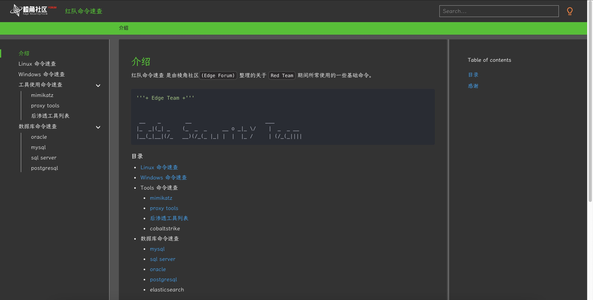
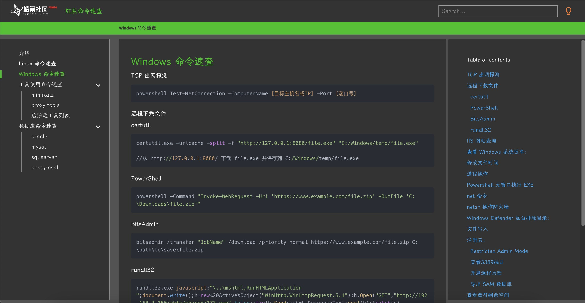

# 介绍

红队命令速查 是由棱角社区`(Edge Forum)` 整理的关于 `Red Team` 期间所常使用的一些基础命令。

在线访问地址：https://forum.ywhack.com/command/

```
'''+ Edge Team +'''


 __    _        __                        ___         
|_  _|(_| _    (_  _  _     __ o _|_ \/    |  _  _ __ 
|__(_|__|(/_   __)(/_(_ |_| |  |  |_ /     | (/_(_||||
```

## 目录

- [Linux 命令速查](Linux%20命令速查.md)
- [Windows 命令速查](Windows%20命令速查.md)
- Tools 命令速查
    - [mimikatz](工具使用命令速查/mimikatz.md)
    - cobaltstrike
- 数据库命令速查
    - [mysql](数据库命令速查/mysql.md)
    - sql server
    - [oracle](数据库命令速查/Oracle.md)
    - [postgresql](数据库命令速查/postgresql.md)
    - elasticsearch

## 本地部署

```
git clone https://github.com/EdgeSecurityTeam/command.git
cd command
python3 -m http.server 8082
http://localhost:8082/site/
```

## Demo





## 感谢
---------
> 以下排名不分先后!

- @loid  
- @r0exper  
- @路人甲
